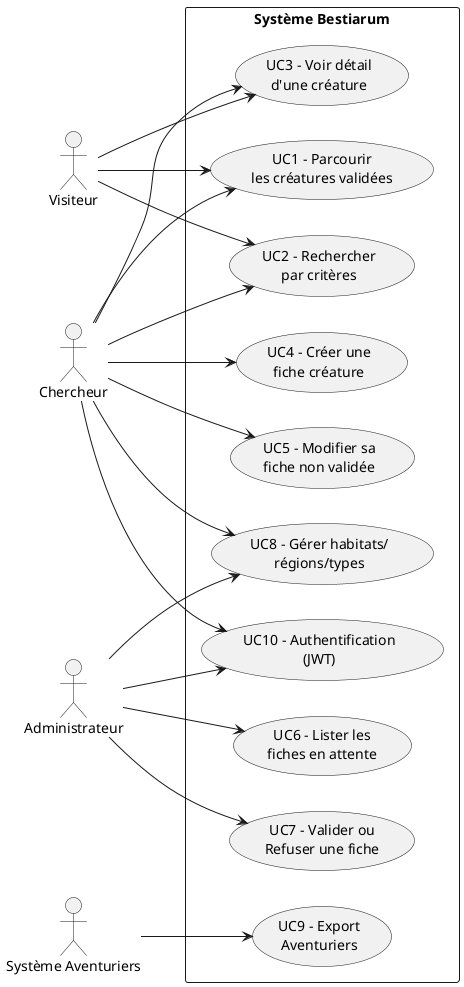

# 🎭 Use Cases — Bestiarum

## 1) Diagramme (PlantUML — version textuelle)

---

## 2) Spécification détaillée des cas

### UC1 — Parcourir les créatures validées

* **Acteurs** : Visiteur, Chercheur, Admin
* **Préconditions** : Aucune, données existantes validées.
* **Flux principal** :

  1. L’utilisateur ouvre la liste.
  2. Le système renvoie les créatures `est_validee=true` paginées.
* **Flux alternatifs** :

  * A1 : Filtrage tri/pagination → liste restreinte.
* **Postconditions** : Aucune modification d’état.
* **Règles** : 20 éléments/page par défaut.

### UC2 — Rechercher par critères

* **Acteurs** : Visiteur, Chercheur, Admin
* **Préconditions** : UC1.
* **Flux principal** :

  1. L’utilisateur saisit critères (nom/type/habitat/region/dangerosité).
  2. Le système renvoie liste filtrée.
* **Exceptions** :

  * E1 : Valeurs invalides → 400 + message.
* **Postconditions** : Aucune.

### UC3 — Voir détail d’une créature

* **Acteurs** : Tous
* **Préconditions** : La fiche est **validée**, ou l’utilisateur est son **auteur** ou **admin**.
* **Flux principal** :

  1. L’utilisateur demande `/creatures/{id}`.
  2. Le système renvoie la fiche si autorisé.
* **Exceptions** :

  * E1 : 404 si non trouvée ou non autorisée (selon politique).
* **Postconditions** : Aucune.

### UC4 — Créer une fiche créature

* **Acteurs** : Chercheur (auth)
* **Préconditions** : Authentification JWT valide.
* **Flux principal** :

  1. Le chercheur poste un JSON (nom, type, dangerosité, habitats, régions…).
  2. Le système valide les champs et enregistre la fiche `est_validee=false`.
  3. Le système retourne `201` + ressource créée.
* **Exceptions** :

  * E1 : 400 (validation),
  * E2 : 401 (JWT absent/expiré).
* **Postconditions** : Fiche en état **DRAFT** (ou **PENDING** si soumise).

### UC5 — Modifier sa fiche non validée

* **Acteurs** : Chercheur (auth)
* **Préconditions** : UC4, l’auteur = demandeur, fiche non validée.
* **Flux principal** :

  1. L’auteur envoie `PUT /creatures/{id}`.
  2. Le système met à jour si autorisé.
* **Exceptions** :

  * E1 : 403 si pas auteur,
  * E2 : 409 si déjà validée (verrouillage).
* **Postconditions** : Fiche mise à jour.

### UC6 — Lister les fiches en attente

* **Acteurs** : Admin
* **Préconditions** : Auth admin.
* **Flux principal** :

  1. Admin demande `/creatures/pending`.
  2. Système renvoie fiches `est_validee=false`.
* **Postconditions** : Aucune.

### UC7 — Valider ou Refuser une fiche

* **Acteurs** : Admin
* **Préconditions** : Fiche existante non validée.
* **Flux principal (Valider)** :

  1. Admin envoie `PUT /creatures/{id}/validate`.
  2. Système enregistre validation + date.
* **Flux alternatif (Refuser)** :

  1. Admin envoie `PUT /creatures/{id}/reject` avec motif.
* **Exceptions** :

  * E1 : 404 si non trouvée,
  * E2 : 409 si déjà validée.
* **Postconditions** : État **VALIDATED** ou **REJECTED**.

### UC8 — Gérer habitats / régions / types

* **Acteurs** : Chercheur (proposition), Admin (validation finale)
* **Préconditions** : Auth requise.
* **Flux principal** :

  1. CRUD sur listes de référence (avec modération si souhaitée).
* **Exceptions** :

  * E1 : 409 si doublon (unique nom/libellé).
* **Postconditions** : Tables de référence à jour.

### UC9 — Export Aventuriers

* **Acteurs** : Système Aventuriers (clé API ou JWT machine)
* **Préconditions** : Autorisation tierce valide.
* **Flux principal** :

  1. Appel `/export/creatures?dangerosite_min=...&region=...`.
  2. Système renvoie JSON filtré.
* **Exceptions** :

  * E1 : 403 si clé invalide.
* **Postconditions** : Aucune.

### UC10 — Authentification (JWT)

* **Acteurs** : Chercheur, Admin
* **Préconditions** : Utilisateur créé (par admin).
* **Flux principal** :

  1. POST `/auth/login` (email+mdp).
  2. 200 + `access_token` (JWT) + `refresh_token` (option).
* **Exceptions** :

  * E1 : 401 identifiants invalides.
* **Postconditions** : Session logique côté client.