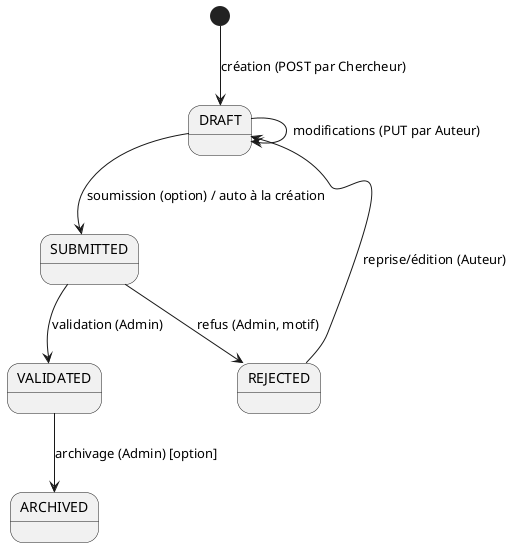
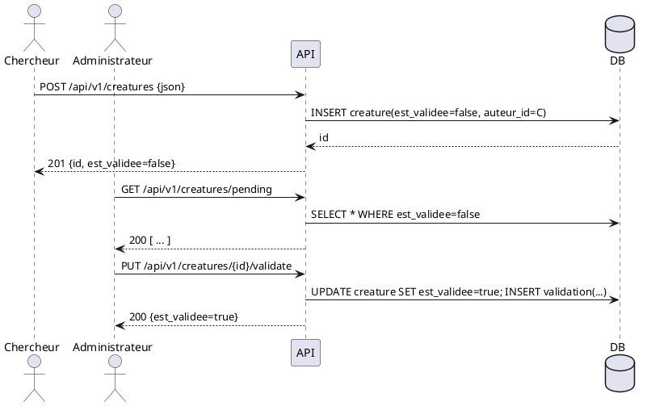
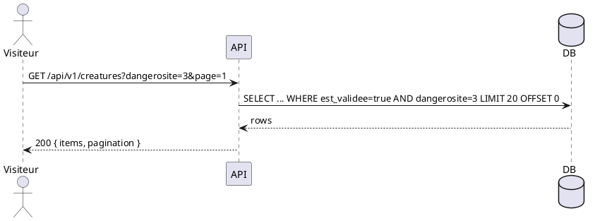
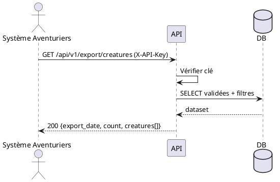

# 🔄 Flux & états — Bestiarum

## 1) Machine à états — Fiche créature


**Politique v1 simplifiée** : création = `SUBMITTED` directement; l’auteur peut éditer jusqu’à validation.

---

## 2) Séquence — Création puis validation



---

## 3) Séquence — Consultation publique



---

## 4) Séquence — Export Aventuriers



---

## 5) Erreurs & politique d’accès

* **401** si JWT manquant/invalide (endpoints protégés),
* **403** si rôle insuffisant,
* **404** si ressource inexistante ou non autorisée,
* **409** si état incompatible (ex : déjà validée),
* **422** si validation de champs échoue (option vs 400),
* **429** si limite de débit atteinte (option).

---

## 6) Métadonnées d’API

* **Pagination** : `?page=1&per_page=20`; en-têtes `X-Total-Count`, `Link`.
* **Tri** : `?sort=nom:asc` (multi-colonnes possible).
* **Filtrage** : `?type=Dragon&region=2&dangerosite_min=3&dangerosite_max=5`.
* **Dates** : ISO 8601 UTC.
* **Erreurs JSON** :

```json
{ "error": { "code": "VALIDATION_ERROR", "message": "dangerosite must be 1..5", "details": { "dangerosite": ["min 1", "max 5"] } } }
```
